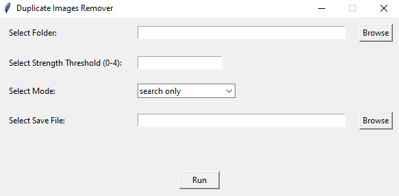

# Duplicate-Images-Remover

## Brief

This is a Python tool designed to detect and remove duplicate images within a specified folder. It utilizes image hashing techniques and offers a user-friendly graphical interface built with Tkinter.

## Snapshot



## Workflow Explanation

The tool operates in two modes: **Search Only** and **Search and Delete**.

1. **Search Only Mode**: It scans the specified folder for duplicate images. It saves the results to a text file indicating which images are duplicates of each other.
   
3. **Search and Delete Mode**: It scans and automatically deletes duplicate images.

The threshold parameter ranges from 0 (most tolerant) to 4 (most aggressive) allowing users to adjust the sensitivity of duplicate detection.

## Setup Instructions

### Using Python Virtual Environment

1. Create a Python virtual environment:
   ```bash
   python -m venv local
   ```
2. Install dependencies:
   ```bash
   .\local\Scripts\pip install imagehash==4.3.1 pillow==10.2.0 tqdm==4.66.2
   ```
3. Run the tool:
   ```bash
   .\local\Scripts\python main.py
   ```

### Using Executables

1. Download the pre-built executable from the releases section.
2. Double-click the executable to run the tool.

## Notes

The application has a terminal showing backend progress.
